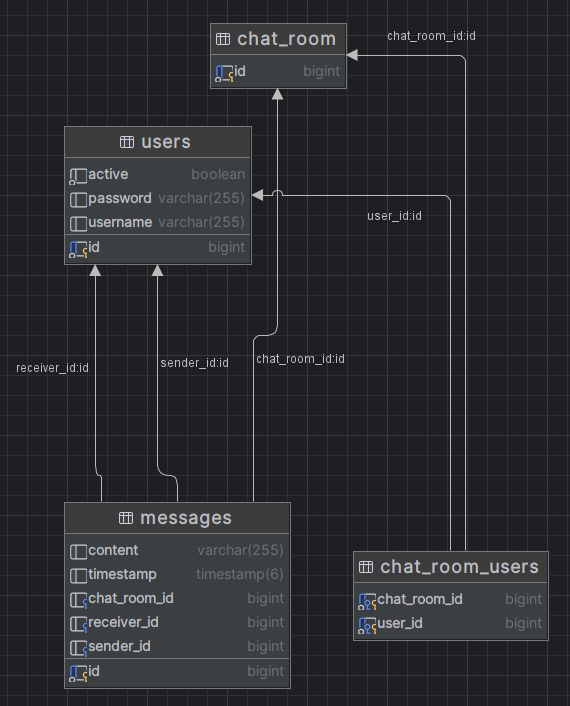

# Чат Приложение

## Обзор

Это простое чат-приложение, разработанное с использованием Spring Boot, JPA и Spring Security. Оно поддерживает регистрацию пользователей, вход в систему, отправку сообщений и просмотр активных пользователей.

### Функции

* Регистрация и вход пользователей
* Аутентификация с использованием Spring Security (Spring Boot версии 3.3.0 - SecurityFilterChain вместо WebSecurityConfigurerAdapter)
* Хэширование паролей с использованием BCrypt
* Отправка сообщений между пользователями через чат-комнаты
* Отправка сообщений одному/нескольким пользователям
* Создание комнаты при отсутствии комнаты между пользователями
* Просмотр списка активных пользователей
* Docker-окружение с базой данных PostgreSQL
* Документация API с помощью Swagger UI

### Предварительные требования
* Java 17+
* Maven
* Docker для запуска базы данных/PostgreSQL БД.

## Инструкции по настройке и запуску.

* git clone https://github.com/VladimirAksenov/chatApp.git
* cd chatApp
* mvn clean install
* docker-compose up -d

### Документация API
Документация API доступна через Swagger UI:
* http://localhost:8080/swagger-ui/index.html#/

Ссылка на Postman коллекцию для тестирования:
* https://api.postman.com/collections/9899123-a3130521-b68c-4785-9e78-4a4bacbfa071?access_key=PMAT-01J0TR8Z0PZMH7TX8XNM7KVTK2

### Схема Базы Данных

### Лицензия
Данный проект лицензирован на условиях [лицензии MIT](https://choosealicense.com/licenses/mit/).
